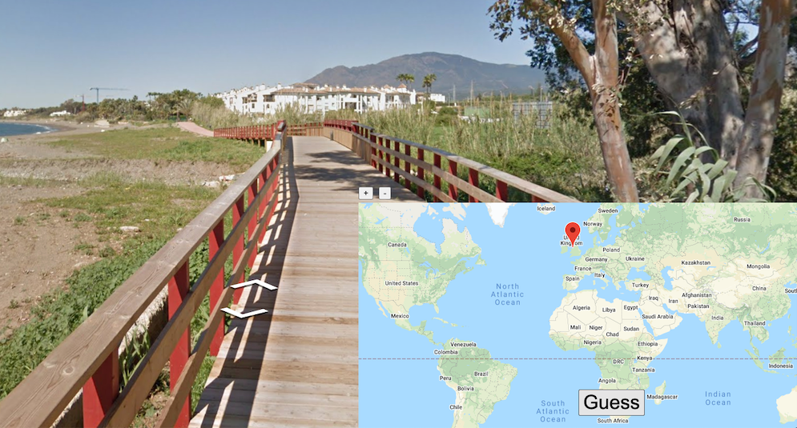
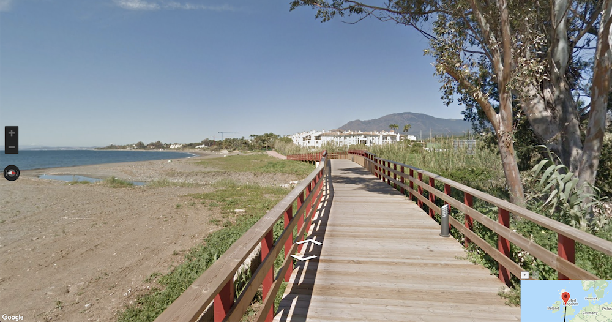
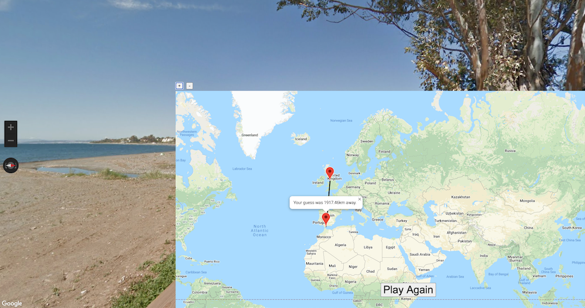
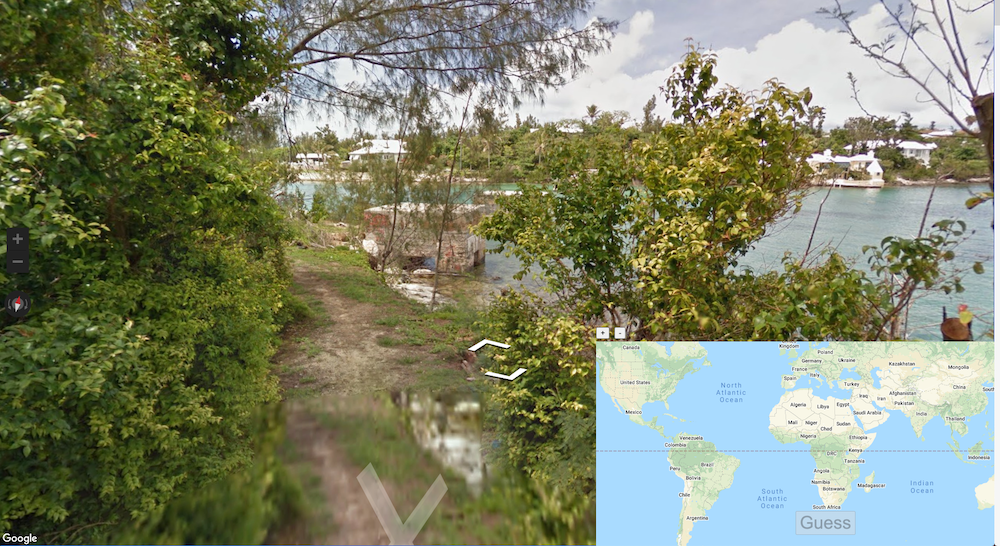
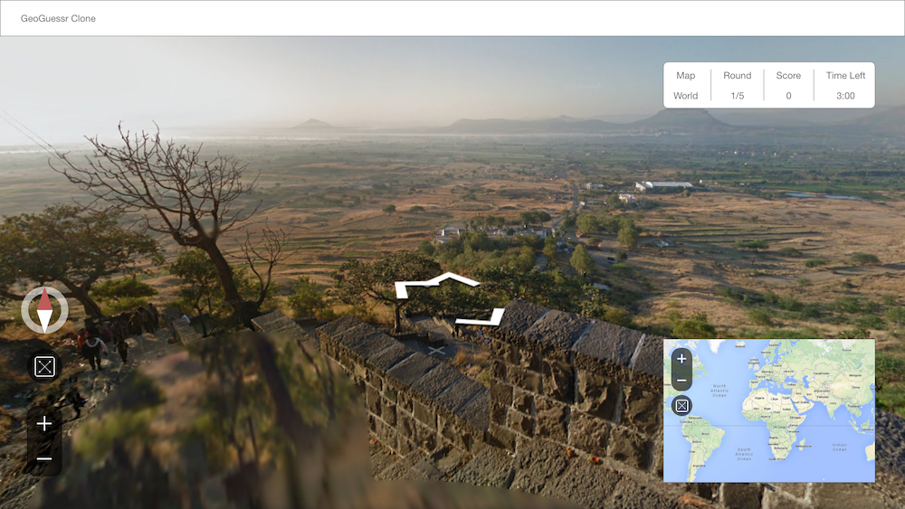
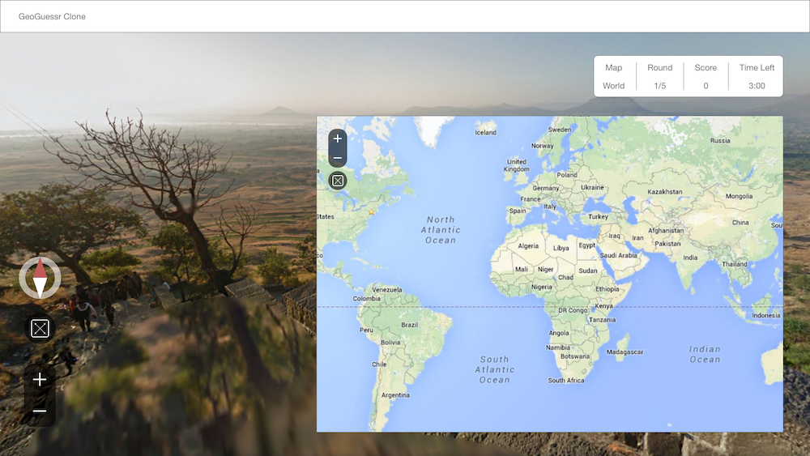
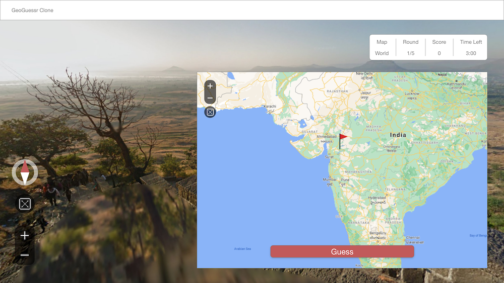
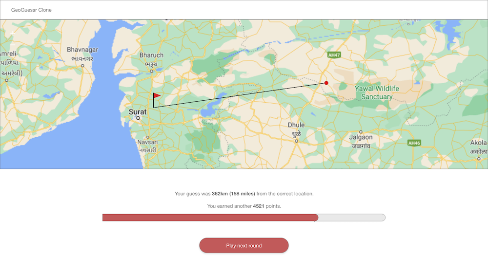
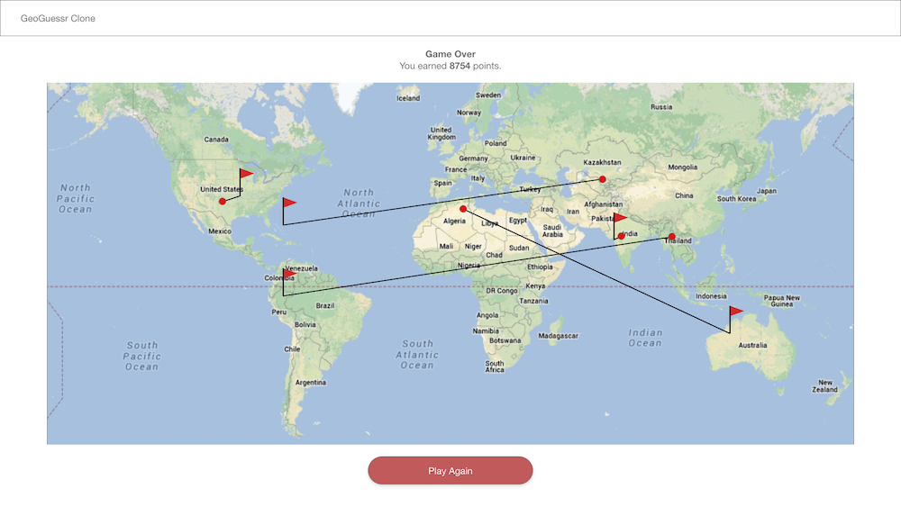

# GeoGuessr Clone
A clone of the popular geography and map game, GeoGuessr. Find yourself on a random Google Maps street view, somewhere in the world, and guess where you are on the world map.

### Motivation
A short description about why you built this app.

---
### Screenshots





---
### User Stories & Wireframes
    * The player finds themselves somewhere on Earth as seen through Google Street View. The task is to guess where. 
    * To look for clues, the player maneuvers through the landscape as one would on Google Street View. 
    * To guess the current location, the player selects a point on the world map.
    * The actual location is revealed. The player is awarded points proportionate to the proximity between their guess and the actual location.
    * The player does this for five rounds. Their final score is the sum of points awarded for all five rounds.








---
### Technologies & Code Snippets
* Google Maps API


I created coordinate bounds to limit random coordinates to regions with Street View, for example:

```
let coordinateSelections = [{
        name: "North America",
        latitude: {
            min: 11,
            max: 54
        },
        longitude: {
            min: -135,
            max: -54
        }
    },
```
A function to return random LatLng coordinates from within the selected region bounds.

```
let getRandomCoordinates = (arr) => {
    let randomIndex = Math.floor(Math.random() * arr.length);
    let obj = arr[randomIndex];
    let randomLat = (Math.random() * (obj.latitude.max - obj.latitude.min) + obj.latitude.min).toFixed(5) * 1;
    let randomLong = (Math.random() * (obj.longitude.max - obj.longitude.min) + obj.longitude.min).toFixed(5) * 1;
    let randomCoord = {
        lat: randomLat,
        lng: randomLong
    };
    return randomCoord;
};
```

Start the game by creating various Google Maps items (Street View panorama, world map, markers, info window) to be assigned later.

```
function startGame(x) {
    panorama = new google.maps.StreetViewPanorama(
        document.getElementById("pano")
    );
    map = new google.maps.Map(document.getElementById("map"), {
        center: {
            lat: 0,
            lng: 0
        },
        zoom: 2,
        streetViewControl: false,
        mapId: 'fd1a1dc518ebfbc1',
        fullscreenControl: false,
        disableDefaultUI: true,
    });
    clickMarker = new google.maps.Marker()
    svMarker = new google.maps.Marker()
    distancePath = new google.maps.Polyline()
    infowindow = new google.maps.InfoWindow({
        disableAutoPan: true
    })
    initMap(x);
}
```
Create the street view with the randomly generated coordiantes

```
// ***INIT MAP ***
function initMap(x, sv) {
    sv = new google.maps.StreetViewService();
    let randomLocation = getRandomCoordinates(coordinateSelections);
    sv.getPanorama({
        location: randomLocation,
        radius: x,
        preference: "nearest",
        source: "outdoor",
    }, processSVData);

}

// *** CALLBACK ***
function processSVData(data, status) {
    if (status === "OK") {
        let location = data.location;
        panorama.setPano(location.pano);
        panorama.setPov({
            heading: 270,
            pitch: 0,
        });
        panorama.setVisible(true);
        panorama.setOptions({
            addressControl: false,
            fullscreenControl: false,
            zoomControlOptions: {
                position: google.maps.ControlPosition.LEFT_CENTER
            },
            panControlOptions: {
                position: google.maps.ControlPosition.LEFT_CENTER
            },


        });
```
Click the map to make an initial guess selection
```
map.addListener("click", (e) => {
            let clickLocation = {
                lat: e.latLng.lat(),
                lng: e.latLng.lng(),
            };
            let svLocation = {
                lat: data.location.latLng.lat(),
                lng: data.location.latLng.lng()
            };
            clickMarker.setPosition(clickLocation)
            clickMarker.setMap(map)
            document.querySelector("#guess").disabled = false;
```
Confirm the guess by clicking the guess button

```
document.querySelector("#guess").addEventListener("click", () => {
                svMarker.setPosition(svLocation)
                svMarker.setMap(map)
                let distance = haversine(clickLocation.lat, clickLocation.lng, svLocation.lat, svLocation.lng);
                endGame(distance);
                let contentString = `Your guess was ${distance.toFixed(2)}km away.`;
                infowindow.setContent(contentString)
                infowindow.open(map, svMarker);
                infowindow.setPosition(svLocation);
                distancePath.setMap(map);
                distancePath.setPath([clickLocation, svLocation])
                fartypoo = findBounds(clickLocation, svLocation)
                map.fitBounds(fartypoo)
                document.querySelector("#play-again").style.display = "block";
                document.querySelector("#guess").style.display = "none";
                // *** *** PLAY AGAIN *** *** //
                document.querySelector("#play-again").addEventListener("click", () => {
                    reset(distancePath, svMarker, clickMarker);
                    initMap(x);
                });
            });
```
Error handling: If there is no street view within 1000km of the random coordinates, double the search radius. Repeat this process a maximum of 3 times to prevent an infinite loop of API calls.

```
else {
        counter++;
        if (counter == 3) {
            console.error("Street View data not found for this location.");

        } else {
            initMap(x * 2);
        }

    }
}
```

Function to generate the coordinate bounds between guessed coordinates and the street view coordinates

```
let findBounds = (clickLocation, svLocation) => {
    let latArr = [clickLocation.lat, svLocation.lat]
    latArrSorted = latArr.sort((a, b) => a - b)
    let lngArr = [clickLocation.lng, svLocation.lng]
    lngArrSorted = lngArr.sort((a, b) => a - b);
    boundsLiteral = {
        south: latArrSorted[0],
        west: lngArrSorted[0],
        north: latArrSorted[1],
        east: latArrSorted[1],
    }
    console.log(boundsLiteral)

    return boundsLiteral
}
```

---
### Credits
Give credit to any `codepen` that inspired you, `medium` article that helped you, or `stackoverflow` that pointed you in the right direction.

---

### Future development
What are the next steps for the project? How will you continue to evolve it?